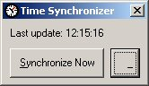

<div align="center">

## Time Synchronizer


</div>

### Description

This program will synchronize the system's time with an atomic time server every hour. While the program uses the atomic clock in Berlin, a user defined NTP server can be specified inside "settings.txt".

You can also minimize the program to the system tray. A left button double click will restore the application, a right button double click will close it. After a Windows Explorer crash, the tray icon will be automatically restored.
 
### More Info
 
Possible errors might occur when the DST settings between server and client differ.


<span>             |<span>
---                |---
**Submitted On**   |2004-05-20 12:14:36
**By**             |[Sebastian Mares](https://github.com/Planet-Source-Code/PSCIndex/blob/master/ByAuthor/sebastian-mares.md)
**Level**          |Beginner
**User Rating**    |5.0 (15 globes from 3 users)
**Compatibility**  |VB 6\.0
**Category**       |[Complete Applications](https://github.com/Planet-Source-Code/PSCIndex/blob/master/ByCategory/complete-applications__1-27.md)
**World**          |[Visual Basic](https://github.com/Planet-Source-Code/PSCIndex/blob/master/ByWorld/visual-basic.md)
**Archive File**   |[Time\_Synch1747945202004\.zip](https://github.com/Planet-Source-Code/sebastian-mares-time-synchronizer__1-53903/archive/master.zip)

### API Declarations

```
CallWindowProc
RegisterWindowMessage
SetWindowLong
Shell_NotifyIcon
```


